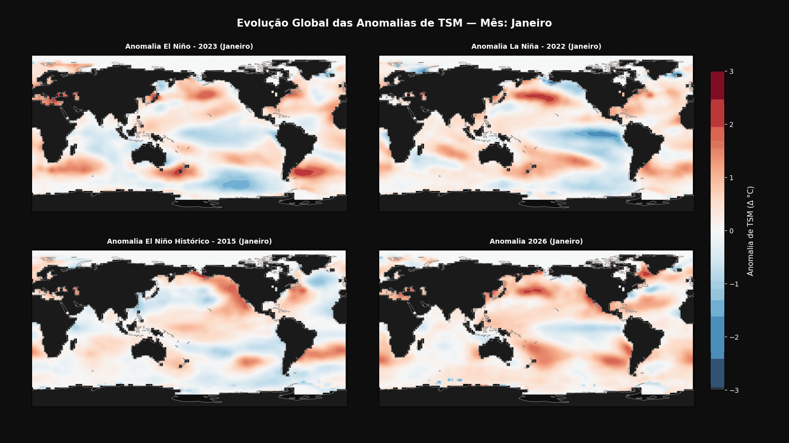
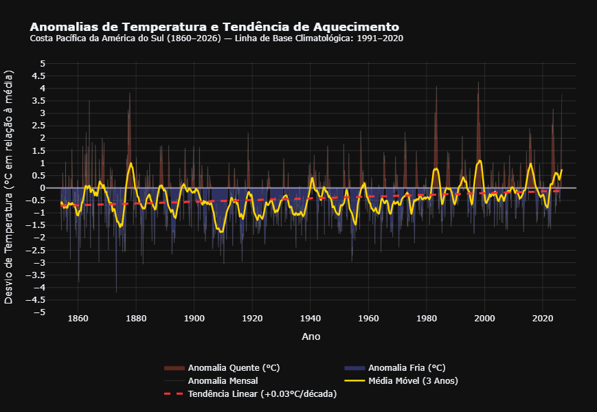

# Análise de Temperatura da Superfície do Mar (TSM / SST)

Este repositório contém a análise exploratória, tratamento estatístico e visualizações gráficas da evolução da Temperatura da Superfície do Mar (TSM/SST).

## Sumário

1. [Visão Geral e Explicação do Notebook](#visão-geral-e-explicação-do-notebook)
2. [Visualizações e Gráficos Gerados](#visualizações-e-gráficos-gerados)
3. [Estrutura do Repositório](#estrutura-do-repositório)
4. [Como Enviar o Notebook para o Repositório Git](#como-enviar-o-notebook-para-o-repositório-git)
5. [Tecnologias Utilizadas](#tecnologias-utilizadas)

---

## Visão Geral e Explicação do Notebook

Abaixo consta a explicação sucinta de cada etapa do pipeline processado no Jupyter Notebook:

1. **Importação e Configuração de Bibliotecas:**
   * Carga de módulos essenciais (`pandas`, `numpy`, `plotly`, `matplotlib`, `seaborn`) e definição do tema visual dos gráficos.
2. **Carregamento e Limpeza de Dados:**
   * Leitura das bases históricas de TSM, tratamento de valores nulos (`NaN`), conversão de tipos numéricos e padronização das colunas temporais (anos/meses).
3. **Cálculo de Anomalias e Estatísticas Climatológicas:**
   * Cálculo da média climatológica base e extração das anomalias térmicas mensais e anuais.
4. **Visualizações Gráficas e Animações:**
   * Geração de gráficos interativos com Plotly e exportação de animações geográficas/temporais (`.gif`).

---

## Visualizações e Gráficos Gerados

As imagens e animações geradas durante a execução do projeto estão salvas no repositório:

### 1. Evolução Global da TSM (Animação)
Acompanhamento temporal da variação de temperatura ao longo dos anos.


### 2. Série Temporal
Gráficos de linhas e dispersão mostrando as variações de temperatura.



### 3. Anomalias
Análises comparativas e distribuições estatísticas.


### 4. Anomalias e Tendências


---

## Estrutura do Repositório

```
.
├── El_nino.ipynb                # Notebook com os códigos de análise
├── evolucao_global_tsm_2026.gif  # Animação gerada
├── newplot.png                   # Gráfico exportado
├── newplot (1).png               # Gráfico exportado
├── newplot (2).png               # Gráfico exportado
├── newplot (3).png               # Gráfico exportado
├── newplot (4).png               # Gráfico exportado
├── newplot (5).png               # Gráfico exportado
├── README.md                     # Documentação do projeto
└── .gitignore                    # Arquivos ignorados pelo Git
```

---

## Tecnologias Utilizadas

* **Linguagem:** Python
* **Manipulação de Dados:** Pandas, NumPy
* **Visualização de Dados:** Plotly, Matplotlib, Seaborn
* **Ambiente de Desenvolvimento:** Jupyter Notebook / VS Code

> ⚠️ **Nota de Pendência:** Falta realizar redução de algarismos significativos nos resultados calculados.

---